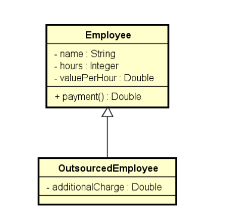

# Polimorfismo

## Desafio
  
Uma empresa possui funcionários próprios e terceirizados.Para cada funcionário, deseja-se registrar nome, horas trabalhadas e valor por hora. Funcionários terceirizadopossuem ainda uma despesa adicional.

  
O pagamento dos funcionários corresponde ao valor da horamultiplicado pelas horas trabalhadas, sendo que os funcionários terceirizados ainda recebem um bônus
correspondente a 110% de sua despesa adicional.

## Classes implementadas no exemplo  
   
   
